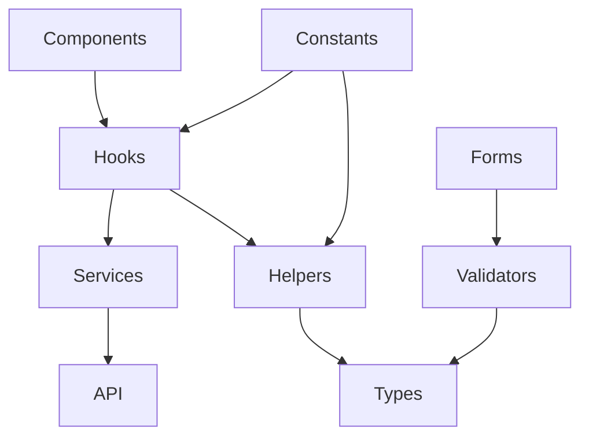

# 📚 Fizanakara - Bibliothèque centrale (`/lib`)

## 📁 Structure du dossier

```
lib/
├── constant/           # Constantes et configuration
├── helpers/            # Fonctions utilitaires
├── types/              # Types TypeScript et interfaces
├── validators/         # Schémas de validation Zod
└── README.md           # Cette documentation
```

## 🎯 Rôle du dossier `lib`

Le dossier `lib` contient le **cœur logique** de l'application. Il est conçu pour être :
- **Centralisé** : Toute la logique métier réutilisable
- **Typé** : Types TypeScript stricts
- **Testable** : Fonctions pures et validateurs
- **Indépendant** : Pas de dépendances UI

## 📦 Modules

### 1. **Constants** (`/constant`)
Configuration globale et valeurs immuables.

```typescript
import { THEME, GITHUB_URLS, COTISATION_UI } from '../lib/constant';

// Thème de l'application
const primaryColor = THEME.colors.primary; // "#FF4B4B"

// URLs des images
const imageUrl = getImageUrl('photo.jpg', 'Jean Dupont');

// États des cotisations
const status = COTISATION_UI.PAID; // { label: "Payé", color: "text-green-600", ... }
```

### 2. **Helpers** (`/helpers`)
Fonctions utilitaires pures.

| Helper | Description | Exemple |
|--------|-------------|---------|
| `formatCurrency` | Formate les montants | `formatCurrency(15000, 'Ar')` → `"15 000 Ar"` |
| `formatDate` | Formate les dates | `formatDate('2024-01-15', 'long')` → `"lundi 15 janvier 2024"` |
| `getInitials` | Génère les initiales | `getInitials('Jean', 'Dupont')` → `"JD"` |
| `calculateAge` | Calcule l'âge | `calculateAge('1990-05-20')` → `34` |
| `groupBy` | Groupe un tableau | `groupBy(members, 'districtId')` |

### 3. **Types** (`/types`)
Interfaces TypeScript pour tout le projet.

```typescript
import { PersonResponseModel, ContributionStatus } from '../lib/types';

// Types principaux
type Member = PersonResponseModel;
type Status = ContributionStatus;

// Enums
enum Gender { MALE, FEMALE }
enum UserRole { ADMIN, SUPERADMIN }
```

### 4. **Validators** (`/validators`)
Schémas Zod pour la validation des formulaires.

```typescript
import { personSchema } from '../lib/validators';

// Validation automatique
const result = personSchema.safeParse(formData);
if (result.success) {
    // Données valides
    const validData = result.data;
}
```

## 🔗 Relations entre modules

```
┌─────────────┐     ┌─────────────┐     ┌─────────────┐
│   Helpers   │────▶│    Types    │◀────│  Validators │
└─────────────┘     └─────────────┘     └─────────────┘
       │                   │                    │
       ▼                   ▼                    ▼
┌─────────────┐     ┌─────────────┐     ┌─────────────┐
│   Constants │────▶│   Services  │◀────│   Hooks     │
└─────────────┘     └─────────────┘     └─────────────┘
```

## 🚀 Utilisation dans les composants

```tsx
import React from 'react';
import { useMembers } from '../hooks';
import { formatCurrency, getMemberStatusLabel } from '../lib/helpers';
import { MemberStatus } from '../lib/types';

export const MemberCard: React.FC<{ member: PersonResponseModel }> = ({ member }) => {
    const statusLabel = getMemberStatusLabel(member.status);
    const contributionAmount = formatCurrency(member.contribution, 'Ar');
    
    return (
        <div>
            <h3>{member.firstName} {member.lastName}</h3>
            <span className={getStatusColor(member.status)}>{statusLabel}</span>
            <p>Cotisation: {contributionAmount}</p>
        </div>
    );
};
```

## 📊 Diagramme de dépendances



## ✅ Bonnes pratiques

1. **Imports** : Toujours depuis `../lib` (pas de chemins profonds)
   ```typescript
   // ✅ Correct
   import { formatDate } from '../lib/helpers';
   
   // ❌ À éviter
   import { formatDate } from '../lib/helpers/dateHelpers';
   ```

2. **Exports** : Un seul export par fichier pour les fonctions principales
   ```typescript
   // ✅ Correct
   export const myFunction = () => {};
   
   // ❌ À éviter
   export default myFunction;
   ```

3. **Typage** : Toujours explicite pour les fonctions publiques
   ```typescript
   // ✅ Correct
   export const calculate = (a: number): number => a * 2;
   
   // ❌ À éviter
   export const calculate = (a) => a * 2;
   ```

## 🧪 Tests

Chaque helper doit avoir son fichier de test :

```
helpers/
├── dateHelpers.ts
├── dateHelpers.test.ts    ✓
├── currencyHelpers.ts
├── currencyHelpers.test.ts ✓
└── ...
```

## 📈 Performance

- Tous les helpers sont **purs** (pas d'effets de bord)
- Les validateurs utilisent **Zod** (optimisé)
- Les types sont **exactement** ce dont les composants ont besoin

---

## 📝 Notes de version

| Version | Date | Changements |
|---------|------|-------------|
| 1.0.0 | 2024-01 | Initialisation |
| 1.1.0 | 2024-02 | Ajout des helpers de validation |
| 1.2.0 | 2024-03 | Migration vers Zod pour validation |

---

## 🔄 Workflow de contribution

1. Créer/modifier un fichier dans `lib/`
2. Tester avec `npm run test:lib`
3. Mettre à jour ce README si nécessaire
4. Soumettre une PR

